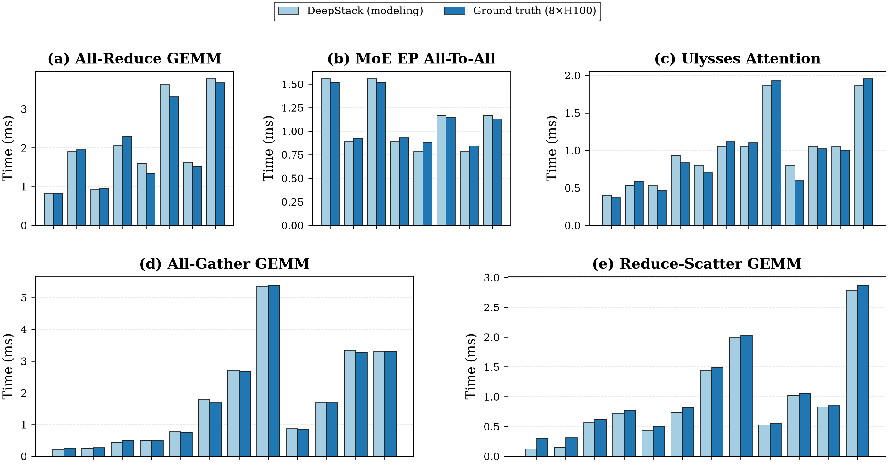
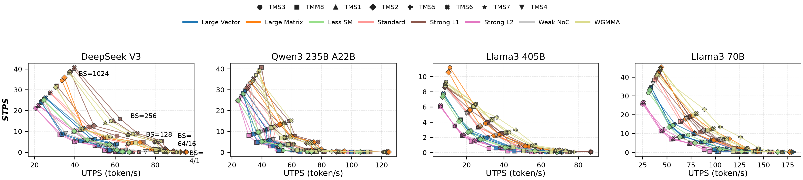
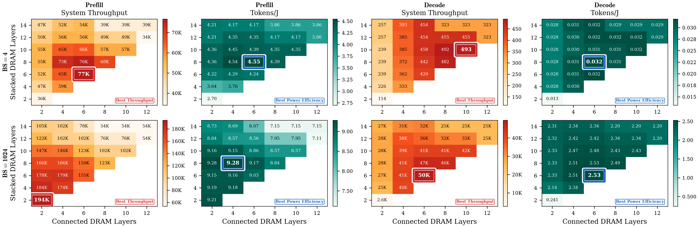
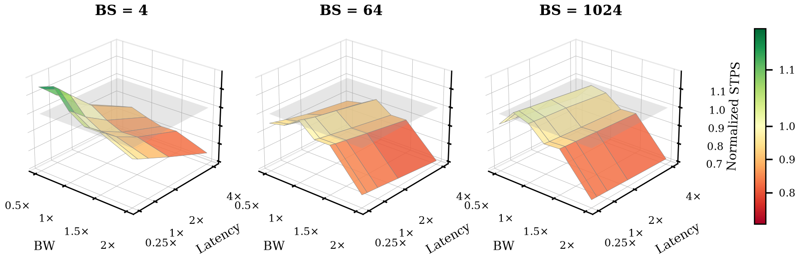

# DeepStack artifact evaluation

This repository is the artifact for **“DeepStack: Facilitating Co-Design
Exploration of 3D DRAM-Stacked Accelerators for Distributed LLM Inference.”**
It provides a CPU-only workflow for rerunning the supported analytical
experiments, checking their outputs, and rendering the paper-facing figures.
After environment setup, reproduction does not require a GPU, model weights,
an external simulator, or an external plotting workspace.

## What the artifact provides

- GPU kernel/operator and end-to-end LLM prefill/decode modeling with
  DeepStack and TileSight.
- Distributed-inference exploration across parallelism, collectives,
  hierarchical NoC, and stacked-DRAM configurations.
- Bandwidth, throughput, energy, thermal, capacity, and selected DSE
  evaluations used by the paper.
- Public NVIDIA and AMD GPU descriptions plus source-visible interfaces for
  caller-defined architecture, DRAM, topology, per-level latency/bandwidth,
  energy, and capacity inputs.
- A standalone [DRAM bank oracle](src/deepstack/bank_oracle/README.md) with
  constructive schedule checks, routing traces, and a self-contained
  [HTML dashboard](src/deepstack/bank_oracle/visualization/artifacts/bank_wave_demo.html).
- Automated environment checks, a short smoke run, a 15-stage reproduction,
  independent result verification, and PNG/PDF plotting.

## Figure preview

All 16 pre-rendered figure groups are available as PNG and PDF files under
[`prebuilt/figures/`](prebuilt/figures/). They are provided only for browsing;
the workflow and verifier never use them as inputs.

<p align="center">
  <a href="prebuilt/figures/fig08_modeling_accuracy_h100.png"></a>
  <a href="prebuilt/figures/fig15_decode_pareto.png"></a>
  <a href="prebuilt/figures/fig19_prefill_decode_dse_heatmaps.png"></a>
  <a href="prebuilt/figures/fig21_noc_bw_latency_sensitivity.png"></a>
</p>

## Quick start

The supported host is x86-64 Linux with glibc 2.29 or newer and Conda.
`setup.sh` creates a CPython 3.11 environment and runs the environment doctor.
For a GitHub clone, materialize the large DSE table with Git LFS first; this
step is not needed for a fully materialized DOI archive.

```bash
git lfs pull
./setup.sh
conda run --no-capture-output -n deepstack-ae ./run.sh quick
conda run --no-capture-output -n deepstack-ae \
  ./run.sh reproduce --workers 32
```

The full run is intended for a host with about 32 CPU cores, 64 GiB RAM, and
5 GiB free space; use a smaller `--workers` value when needed. Setup may
access the network to install dependencies, while the model runs are
repository-local.

## Results

The quick run writes to `results/quick/`. The full workflow writes generated
CSVs, logs, manifests, verification summaries, and 16 PNG/PDF figure groups
to `results/reproduce/`.

Recheck or redraw an existing full result bundle with:

```bash
conda run --no-capture-output -n deepstack-ae \
  ./verify.sh results/reproduce
conda run --no-capture-output -n deepstack-ae \
  ./run.sh plot --result-dir results/reproduce
```

The workflow reruns the analytical model. Bundled GPU measurements and
ASTRA-Sim/NS-3 outputs are checksummed comparison inputs, not fresh hardware
or simulator runs. It reports both the submitted-paper compatibility path and
the current corrected path. Exact coverage, source versions, expected
outputs, and per-result provenance are in the
[reproducibility matrix](docs/result_matrix.md).

## Repository layout

| Path | Contents |
|---|---|
| `ae/` | workflow, stage runners, verification, and plotting |
| `src/deepstack/` | analytical/DSE model and bank oracle |
| `src/tilesight/` | GPU kernel and distributed-performance model |
| `data/`, `configs/` | checksummed references and fixed configurations |
| `tests/` | functional and reusable-interface tests |
| `docs/` | artifact appendix and detailed result/provenance matrix |
| `prebuilt/figures/` | checked-in PNG/PDF previews; never verifier inputs |
| `results/` | reviewer-generated outputs; not required as an input |

Caller-defined studies can use
[`mosaic.arch.custom_profile`](src/deepstack/mosaic/arch/custom_profile.py),
[`mosaic.noc.custom_profile`](src/deepstack/mosaic/noc/custom_profile.py),
[`mosaic.cost.energy`](src/deepstack/mosaic/cost/energy.py), and
[`DramDsePolicy`](src/deepstack/mosaic/dse_space/case_study_dram_layer/dram_layer_config.py).

The complete reference area model and die-area breakdown are not distributed;
the bundled reference interface returns only feasible SM capacity for covered
configurations. Contact the authors for additional area-model coverage.

## Documentation and licensing

The [artifact appendix](docs/artifact_appendix.pdf) is the compact reviewer
guide. The archived artifact is identified by
[DOI 10.5281/zenodo.21351389](https://doi.org/10.5281/zenodo.21351389), and
citation metadata are in [CITATION.cff](CITATION.cff).

> **Mixed-license artifact.** Source code, scripts, documentation, manifests,
> and project data are licensed under Apache-2.0. Four bundled precompiled
> model-support/capacity libraries are proprietary and licensed separately
> under
> [LicenseRef-DeepStack-AE-Binary-1.0](LICENSES/LicenseRef-DeepStack-AE-Binary-1.0.txt).
> The repository as a whole is not Apache-2.0; see
> [LICENSING.md](LICENSING.md) and
> [THIRD_PARTY_NOTICES.md](THIRD_PARTY_NOTICES.md).
